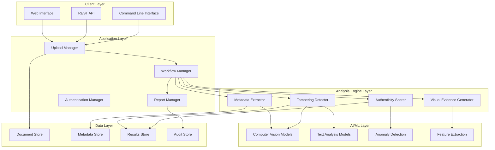

# Design Document: AI-Powered Document Forensics & Verification System

## Overview

The AI-Powered Document Forensics & Verification System is a comprehensive platform that combines traditional digital forensics techniques with modern machine learning approaches to detect document tampering, verify authenticity, and extract forensic evidence. The system employs a multi-layered analysis approach using metadata extraction, computer vision models, and statistical analysis to provide high-confidence assessments of document integrity.

The system architecture follows a microservices pattern with specialized components for different types of analysis, enabling scalable processing and modular deployment. Key innovations include cascading ML models for tampering detection, comprehensive metadata analysis pipelines, and automated report generation with visual evidence presentation.

## Architecture

The system follows a layered architecture with clear separation between data ingestion, analysis engines, and presentation layers:



The architecture supports horizontal scaling through containerized microservices and implements event-driven communication between components using message queues for asynchronous processing.

## Components and Interfaces

### Upload Manager
**Purpose**: Handles document ingestion, validation, and secure storage
**Key Functions**:
- File format validation and size checking
- Secure file storage with cryptographic hashing
- Progress tracking for upload operations
- Batch upload coordination

**Interface**:
```typescript
interface UploadManager {
  uploadDocument(file: File, metadata: UploadMetadata): Promise<DocumentId>
  validateFormat(file: File): ValidationResult
  getBatchStatus(batchId: string): BatchStatus
  generateHash(document: Document): string
}
```

### Metadata Extractor
**Purpose**: Extracts and analyzes all available metadata from documents
**Key Functions**:
- EXIF data extraction from images
- PDF metadata parsing (creation dates, author info, software signatures)
- Office document property extraction
- Timestamp consistency analysis
- Software fingerprint identification

**Interface**:
```typescript
interface MetadataExtractor {
  extractMetadata(document: Document): Promise<MetadataResult>
  analyzeTimestamps(metadata: Metadata): TimestampAnalysis
  detectSoftwareSignatures(metadata: Metadata): SoftwareSignature[]
  validateMetadataConsistency(metadata: Metadata): ConsistencyReport
}
```

### Tampering Detector
**Purpose**: Uses AI models to identify signs of document modification
**Key Functions**:
- Computer vision analysis for pixel-level inconsistencies
- Text insertion/deletion detection
- Font and formatting consistency analysis
- Digital signature verification
- Copy-paste detection using compression analysis

**Interface**:
```typescript
interface TamperingDetector {
  detectTampering(document: Document): Promise<TamperingResult>
  analyzePixelInconsistencies(image: ImageData): PixelAnalysis
  detectTextModifications(content: TextContent): TextAnalysis
  verifyDigitalSignatures(document: Document): SignatureVerification
  generateTamperingHeatmap(document: Document): HeatmapData
}
```

### Authenticity Scorer
**Purpose**: Calculates overall confidence scores for document authenticity
**Key Functions**:
- Multi-factor authenticity assessment
- Statistical pattern analysis
- Comparison against known authentic samples
- File format specification validation
- Embedded object integrity verification

**Interface**:
```typescript
interface AuthenticityScorer {
  calculateAuthenticityScore(analysisResults: AnalysisResults): AuthenticityScore
  compareAgainstSamples(document: Document, samples: Document[]): ComparisonResult
  validateFileStructure(document: Document): StructureValidation
  assessEmbeddedObjects(document: Document): ObjectAssessment
}
```

### Report Manager
**Purpose**: Generates comprehensive forensic reports with visual evidence
**Key Functions**:
- Multi-format report generation (PDF, JSON, XML)
- Visual evidence compilation
- Statistical summary generation
- Chain of custody documentation
- Expert testimony formatting

**Interface**:
```typescript
interface ReportManager {
  generateReport(analysisResults: AnalysisResults, format: ReportFormat): Promise<Report>
  createVisualEvidence(tamperingData: TamperingResult): VisualEvidence
  generateSummaryStatistics(results: AnalysisResults[]): StatisticalSummary
  documentChainOfCustody(document: Document, actions: AuditAction[]): CustodyReport
}
```

## Data Models

### Document Model
```typescript
interface Document {
  id: DocumentId
  filename: string
  fileType: FileType
  size: number
  uploadTimestamp: Date
  hash: string
  content: Buffer
  metadata: DocumentMetadata
  processingStatus: ProcessingStatus
}
```

### Analysis Results Model
```typescript
interface AnalysisResults {
  documentId: DocumentId
  timestamp: Date
  metadataAnalysis: MetadataAnalysis
  tamperingAnalysis: TamperingAnalysis
  authenticityScore: AuthenticityScore
  visualEvidence: VisualEvidence[]
  confidence: ConfidenceScore
  processingTime: number
}
```

### Tampering Analysis Model
```typescript
interface TamperingAnalysis {
  overallRisk: RiskLevel
  detectedModifications: Modification[]
  pixelInconsistencies: PixelInconsistency[]
  textModifications: TextModification[]
  signatureBreaks: SignatureBreak[]
  compressionAnomalies: CompressionAnomaly[]
  confidenceScore: number
}
```

### Metadata Analysis Model
```typescript
interface MetadataAnalysis {
  extractedMetadata: ExtractedMetadata
  timestampConsistency: TimestampConsistency
  softwareSignatures: SoftwareSignature[]
  anomalies: MetadataAnomaly[]
  geoLocation?: GeoLocation
  deviceFingerprint?: DeviceFingerprint
}
```

### Visual Evidence Model
```typescript
interface VisualEvidence {
  type: EvidenceType
  description: string
  imageData: Buffer
  annotations: Annotation[]
  confidenceLevel: number
  analysisMethod: string
}
```

Now I need to use the prework tool to analyze the acceptance criteria before writing the Correctness Properties section:
## Correctness Properties

*A property is a characteristic or behavior that should hold true across all valid executions of a system—essentially, a formal statement about what the system should do. Properties serve as the bridge between human-readable specifications and machine-verifiable correctness guarantees.*

### Property Reflection

After analyzing all acceptance criteria, several properties can be consolidated to eliminate redundancy:

- File validation properties (1.1, 1.2, 1.3) can be combined into comprehensive input validation
- Metadata extraction properties (2.1, 2.4) can be unified as comprehensive metadata extraction
- Tampering detection properties (3.1, 3.2, 3.3) can be consolidated into multi-modal tampering detection
- Security properties (7.1, 7.3, 7.4) can be combined into comprehensive security validation
- API properties (8.1, 8.4) can be unified as API contract validation

### Core Properties

**Property 1: Comprehensive File Validation**
*For any* uploaded file, the system should accept it if and only if it meets all validation criteria (supported format, within size limits, not corrupted), and provide appropriate error messages for any validation failures.
**Validates: Requirements 1.1, 1.2, 1.3**

**Property 2: Secure Document Handling**
*For any* document processed by the system, it should be stored with cryptographic hashing, encrypted at rest, transmitted securely, and maintain integrity throughout the entire analysis pipeline.
**Validates: Requirements 1.5, 7.1, 7.3, 7.4**

**Property 3: Comprehensive Metadata Extraction**
*For any* document containing metadata, the system should extract all available metadata fields (creation dates, author info, EXIF data, software signatures) and identify any present anomalies or inconsistencies.
**Validates: Requirements 2.1, 2.2, 2.3, 2.4, 2.5**

**Property 4: Multi-Modal Tampering Detection**
*For any* document analyzed for tampering, the system should examine all applicable modalities (text modifications, pixel inconsistencies, font changes, digital signatures) and provide confidence scores with specific location data for detected tampering.
**Validates: Requirements 3.1, 3.2, 3.3, 3.4, 3.5**

**Property 5: Authenticity Assessment Completeness**
*For any* document undergoing authenticity analysis, the system should calculate confidence scores based on multiple forensic indicators, compare against reference samples when available, validate file structure, and provide a comprehensive assessment.
**Validates: Requirements 4.1, 4.2, 4.3, 4.4, 4.5**

**Property 6: Comprehensive Report Generation**
*For any* completed analysis, the system should generate reports containing all findings, visual evidence, confidence scores, technical details, and be exportable in multiple formats.
**Validates: Requirements 5.1, 5.2, 5.3, 5.4, 5.5**

**Property 7: Batch Processing Reliability**
*For any* batch of documents submitted for processing, the system should process them in parallel, track progress accurately, handle errors gracefully without stopping the batch, and generate comprehensive summary reports.
**Validates: Requirements 6.1, 6.2, 6.3, 6.4, 6.5**

**Property 8: Progress Tracking Consistency**
*For any* document or batch being processed, the system should provide real-time progress updates that accurately reflect the current processing state and completion percentage.
**Validates: Requirements 1.4, 6.2**

**Property 9: Audit Trail Integrity**
*For any* action performed in the system, it should be logged with complete information (timestamp, user, action details) in an immutable, tamper-evident audit trail.
**Validates: Requirements 7.2, 7.5**

**Property 10: API Contract Compliance**
*For any* API request made to the system, it should respond according to RESTful principles with properly formatted data (JSON/XML), implement secure authentication, support webhooks, and enforce configurable rate limits.
**Validates: Requirements 8.1, 8.2, 8.3, 8.4, 8.5**

## Error Handling

The system implements comprehensive error handling across all layers:

### Input Validation Errors
- **File Format Errors**: Clear messaging for unsupported formats with list of supported types
- **Size Limit Errors**: Specific information about maximum allowed size and current file size
- **Corruption Errors**: Detection and reporting of corrupted or incomplete files
- **Authentication Errors**: Secure error messages that don't leak sensitive information

### Processing Errors
- **Analysis Failures**: Graceful degradation when specific analysis components fail
- **Resource Exhaustion**: Proper handling of memory and processing limits
- **Timeout Handling**: Configurable timeouts with partial result preservation
- **Model Errors**: Fallback mechanisms when AI models encounter unexpected inputs

### System Errors
- **Storage Failures**: Redundant storage with automatic failover
- **Network Errors**: Retry mechanisms with exponential backoff
- **Service Unavailability**: Circuit breaker patterns to prevent cascade failures
- **Data Integrity Errors**: Hash verification and corruption detection

### Error Recovery
- **Partial Results**: Preservation and reporting of partial analysis results
- **Retry Mechanisms**: Intelligent retry for transient failures
- **Rollback Capabilities**: Transaction-like behavior for critical operations
- **User Notification**: Clear, actionable error messages with suggested remediation

## Testing Strategy

The system employs a dual testing approach combining unit tests for specific scenarios with property-based tests for comprehensive validation:

### Unit Testing Approach
Unit tests focus on:
- **Specific Examples**: Known document samples with expected analysis results
- **Edge Cases**: Boundary conditions like maximum file sizes, empty documents
- **Error Conditions**: Invalid inputs, corrupted files, authentication failures
- **Integration Points**: API endpoints, database operations, external service calls

### Property-Based Testing Configuration
- **Testing Framework**: Hypothesis for Python components, fast-check for TypeScript components
- **Test Iterations**: Minimum 100 iterations per property test to ensure statistical confidence
- **Input Generation**: Smart generators that create realistic document samples, metadata variations, and tampering scenarios
- **Shrinking Strategy**: Automatic reduction of failing test cases to minimal reproducible examples

### Property Test Implementation
Each correctness property will be implemented as a property-based test with the following structure:
- **Test Tag Format**: `Feature: document-forensics, Property {number}: {property_text}`
- **Generator Strategy**: Domain-specific generators for documents, metadata, and tampering scenarios
- **Assertion Strategy**: Multi-faceted assertions covering functional correctness, performance bounds, and security requirements
- **Coverage Tracking**: Ensure property tests exercise all critical code paths

### Test Data Management
- **Synthetic Data Generation**: Programmatic creation of test documents with known characteristics
- **Reference Samples**: Curated collection of authentic documents for comparison testing
- **Tampering Scenarios**: Systematically generated tampered documents for detection validation
- **Performance Benchmarks**: Standardized test suites for performance regression detection

### Continuous Testing
- **Automated Test Execution**: All tests run on every code change
- **Performance Monitoring**: Continuous tracking of analysis accuracy and processing speed
- **Model Validation**: Regular validation of AI models against new tampering techniques
- **Security Testing**: Ongoing penetration testing and vulnerability assessment